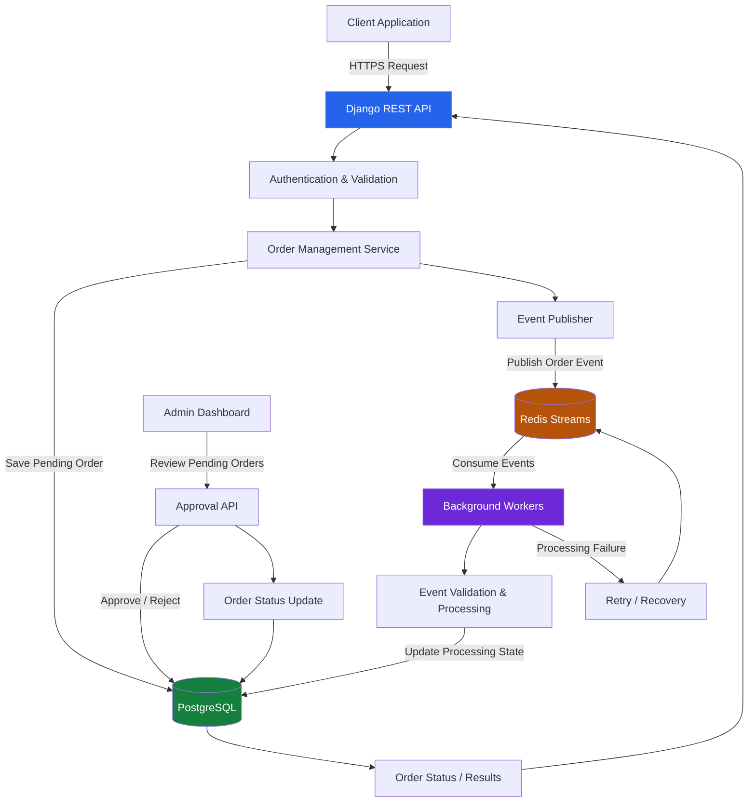

# Event-Driven System Architecture

## High-Level Architecture Diagram

```mermaid
flowchart TD
    A["Client Application"] -->|HTTPS Request| B["Django REST API"]

    B --> C["Authentication & Validation"]
    C --> D["Order Management Service"]

    D -->|Save Pending Order| E[("PostgreSQL")]

    D --> F["Event Publisher"]
    F -->|Publish Order Event| G[("Redis Streams")]

    G -->|Consume Events| H["Background Workers"]

    H --> I["Event Validation & Processing"]
    I -->|Update Processing State| E

    H -->|Processing Failure| J["Retry / Recovery"]

    J --> G

    K["Admin Dashboard"] -->|Review Pending Orders| L["Approval API"]

    L -->|Approve / Reject| E

    L --> M["Order Status Update"]

    M --> E

    E --> N["Order Status / Results"]
    N --> B

    style B fill:#2563eb,color:#fff
    style G fill:#b45309,color:#fff
    style E fill:#15803d,color:#fff
    style H fill:#6d28d9,color:#fff
```
